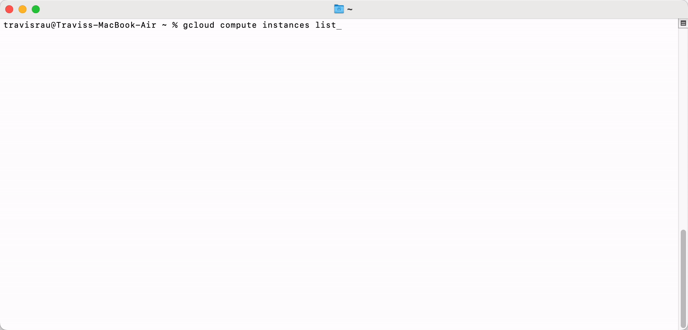

# Honeypot Assignment

**Time spent:** **4** hours spent in total

### MHN-Admin Deployment

**Summary:** How did you deploy it? Did you use GCP, AWS, Azure, Vagrant, VirtualBox, etc.?

I deployed mhn-admin using GCP. 

### Dionaea Honeypot Deployment

**Summary:** Briefly in your own words, what does dionaea do?

Dionaea traps malware and information on attacks/scans so that we can use the information to increase the security

### Database Backup

**Summary:** What is the RDBMS that MHN-Admin uses? What information does the exported JSON file record?
MongoDB is the DBMS used by MHN-Admin. The JSON file records attempted accesses to the honeypot. It records the protocol, date and time, source IP, source port, destination port, an identifier, and the name of the honeypot that was being accessed.

## Notes

I was unaware that I would need to show the setup for the honeypot and mhn UNTIL I completed the entire assignment and saw it at the bottom of the page so I cannot show the actual commands to set it up. I instead showed the proof that I set up the honeypot and mhn-admin.